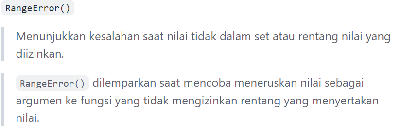

# **WEEK 2**
## Ervina Nurfa Hidayah
## Back-End 28

## **Javascript - Function & Scope**
## Scope

***Scope*** adalah konsep dalam flow data variabel. 

Menentukan suatu variabel bisa diakses pada scope tertentu atau tidak.

***Blocks*** adalah code yang berada didalam curly braces {}.
Bloks digunakan pada *condition, function dan looping*

- **Global scope** berarti variabel yang kita buat dapat diakses dimanapun dalam suatu file.
Suatu variabel harus dideklarasikan diluar Blocks, Agar menjadi Global Scope.

**Contoh Global Scope** :

```
const olahraga = 'athletic';

function namaAtlet() {
  let atlet = 'Davina Putri';
  const noDavina = 10;
  console.log(olahraga); // Output: athletic
  if (olahraga === 'athletic') {
     atlet = 'Putri Aulia';
     const noPutri = 24;
     console.log(olahraga); // Output: Putri
  }
  return atlet;
}

console.log(namaAtlet()); // Output: Putri
console.log(olahraga); // Output: athletic
```

- **Local scope**
Local scope berarti kita mendeklarasikan variabel didalam blocks seperti function, conditional, dan looping.

Maka variabel hanya bisa diakses didalam blocks saja. Tidak bisa diakses diluar blocks.

Jadi, lingkup lokal bisa dibagi lagi menjadi dua tipe:

    - lingkup fungsi (function scope)
    - lingkup blok (block scope)

**Contoh Local Scope** :
```
const olahraga = 'athletic';

function namaAtlet() {
  let atlet = 'Davina Putri'; // lingkup fungsi
  const noDavina = 10; // lingkup fungsi
  if (olahraga === 'athletic') { 
     atlet = 'Putri Aulia';
     const noPutri = 24; // lingkup blok
     console.log(noDavina); // Output: 10  
  }
  console.log(noPutri); // Output: Uncaught ReferenceError: noKobe is not defined
  return atlet;
}

namaAtlet();
```

## Function

***Function*** adalah sebuah blok kode dalam sebuah grup untuk menyelesaikan 1 task/1 fitur.

Function ini bisa kita panggil dan gunakan saat dibutuhkan dalam menyelesaikan task/fitur.

**Mendeklarasikan Function**

Function/Fungsi dapat berdiri sendiri atau disimpan di dalam sebuah variabel.
Cara mendeklarasikan :
```
// Fungsi yang berdiri sendiri (static)
function namaFungsi(){
  // Kode yang akan dijalankan
}

// Fungsi yang disimpan di dalam variabel
let namaVariabelFungsi = function(){
  // Kode yang akan dijalankan
}

// Fungsi arrow
let myFunction = () => {
    // Kode yang akan dijalankan
}
```
Arrow function adalah cara lain menuliskan function. Ini adalah fitur terbaru yang ada pada ES6 (Javascript Version).

**Memanggil Function**

Untuk memanggil function, kita hanya perlu menuliskan nama function yang sudah kita buat.

`myFunction()`
**Contoh :**
```
// Fungsi yang berdiri sendiri
function sapa() {
  return "Selamat Siang!";
}

console.log(sapa()); // Output: Selamat Siang!

// Fungsi disimpan di dalam variabel

let berkenalan = function() {
  return "Hallo, nama saya Nurul.";
};

console.log(berkenalan()); // Output: Hallo, nama saya Nurul.
```
Pada contoh kedua di atas, return value-nya adalah "Hallo, nama saya Nurul.". Bedakan `return` dengan `console.log()`.

`console.log() `hanya menampilkan informasi ke dalam tab console JavaScript, sedangkan `return` akan mengembalikan sebuah nilai ke tempat di mana fungsi itu dipanggil.

Bagaimana jika kita tidak menulis perintah return?
```
let umur = 21;

function ulangTahun() {
    umur += 1;
}

console.log(ulangTahun()); // Output: undefined
```
Fungsi tersebut tidak memiliki perintah `return`. Di JavaScript, apabila tidak ada perintah `return`, secara default fungsi tersebut akan mengembalikan nilai `undefined`.

**Parameter dan Argumen**

***Parameter*** adalah syarat input yang harus dimasukkan ke dalam suatu fungsi dan dideklarasikan bersama dengan deklarasi fungsi.

Sementara **argumen** adalah nilai yang dimasukan ke dalam suatu fungsi, sesuai dengan persyaratan parameter, di mana argumen dituliskan bersamaan dengan pemanggilan fungsi.

**Default Parameter**

Default paramater digunakan untuk memberikan nilai awal/default pada parameter function.

Default parameter bisa digunakan jika kita ingin menjaga function agar tidak error saat dipanggil tanpa argumen.
**Contoh :**
```
function greeting(name = 'Salsa') {
    return 'Hallo ' + name;
}

console.log(greeting('Betha')); // Output: 'Hallo Betha'
console.log(greeting()); // Output: 'Hallo Salsa'
```

**Function Hoisting**

Kita bisa memanggil fungsinya terlebih dahulu sebelum kita mendeklarasikan fungsinya.

**Contoh :**
```
console.log(operasiPerkalian(5, 5)); // Output: 25

function operasiPerkalian(angka1, angka2) {
  return angka1 * angka2;
}
```
Normalnya kita harus mendeklarasikan fungsi terlebih dahulu, setelah itu baru kita memanggil dan menggunakan fungsi tersebut. Namun seperti contoh diatas, fungsi dipanggil terlebih dahulu menggunakan console.log() lalu deklarasi dilakukan setelah pemanggilan fungsi. Itulah yang disebuh dengan Function Hoisting.

Tapi, ini tidak berlaku jika fungsi tersebut dideklarasi di dalam sebuah variabel.

**Contoh :**
```
console.log(operasiPerkalian(5, 5)); // Output: Uncaught ReferenceError: Cannot access 'operasiPerkalian' before initialization

const operasiPerkalian = function(angka1, angka2) {
  return angka1 * angka2;
};
```

## Javascript Error Reference

Error sendiri adalah suatu informasi yang menunjukkan penyimpangan pada software atau kerusakan para perangkat keras PC.

Pengertian Error pada komputer adalah kekeliruan, ketidaktepatan atau kesalahan yang dapat disebabkan oleh software atau perangkat lunak, hardware atau perangkat keras, dan human error yang berarti kesalahan dikarenakan pengguna.

Berikut beberapa tipe error yang sering ditemukan dalam javascript :

- 
- 
- 
- 
- 

# **Property & Method Javascript**

## Property

***Property*** adalah karakteristik suatu objek, sering kali menggambarkan atribut yang terkait dengan struktur data.

Ada 2 macam property :
- Property instance menyimpan data yang spesifik untuk instance objek tertentu.
- Properti statis menyimpan data yang dibagikan di antara semua instance objek.

Property memiliki nama (string, atau simbol) dan nilai (primitive, method, atau object reference).

Salah satu contoh property yang sering digunakan adalah length. Property length ini bersifat read-only dan merupakan property dari string yang berisi panjang string dalam unit kode UTF-16.


## Method

***Method*** adalah fungsi yang merupakan properti dari suatu objek.

Ada 2 macam method :

- Method instance yang merupakan tugas bawaan yang dilakukan oleh instance objek.
- Method static yang merupakan tugas yang dipanggil langsung pada konstruktor objek.

Berikut beberapa contoh method javascript :
- toUpperCase()

Mengembalikan nilai string panggilan yang dikonversi menjadi huruf besar.

- toLowerCase()

Mengembalikan nilai string panggilan yang dikonversi ke huruf kecil.

- charAt()

Mengembalikan nilai karakter yang sudah ditentukan berdasarkan posisi indeks.

- includes()

Untuk mencari nilai/karakter. Jika ditemukan maka akan mengembalikan nilai true dan jika tidak maka akan mengembalikan nilai flase.

# DOM

## Definisi
***DOM*** adalah sebuah cara untuk mengakses element HTML dan merupakan jembatan agar bahasa pemrograman dapat berinteraksi dengan dokumen HTML.DOM itu bukan bagian dari JavaScript, melainkan ini adalah WEB API untuk membuat website.

## Fungsi
Dengan adanya DOM ini, JavaScript diberi akses untuk membuat HTML menjadi dinamis, seperti :

- Mengubah element HTML pada halaman website.
- Mengubah attribute HTML pada halaman website.
- Mengubah CSS style pada halaman website.
- Menambah dan/atau menghapus element maupun attribute HTML.
- Menambah HTML event (contoh: efek klik pada mouse, hover pada mouse, dan lain-lain) pada halaman website.
- Berinteraksi dengan semua HTML event di website.

## Property & Method
Di HTML DOM, semua element HTML dari sebuah website dianggap sebagai objek. Dan sama seperti objek JavaScript pada umumnya, objek element HTML di HTML DOM juga mempunyai properti dan method atau yang lebih dikenal dengan istilah DOM Property dan DOM Method.

Jadi untuk mengubah nilai properti dari element HTML, kita bisa menggunakan DOM Property dan untuk memanggil fungsi dari suatu element HTML, kita bisa menggunakan DOM Method.

## Selecting & Traversing Element
Kita bisa mencari dan memanggil sebuah element yang kita inginkan dengan menggunakan fungsi/method berikut :

- **document.getElementById()**
: Mengembalikan objek elemen yang mewakili elemen yang properti id-nya cocok dengan string yang ditentukan.

- **document.getElementsByClassName()** : Mengembalikan objek seperti array dari semua elemen anak yang memiliki semua nama kelas yang diberikan. Saat dipanggil pada objek dokumen, dokumen lengkap dicari, termasuk simpul akar. Kita juga bisa memanggil getElementsByClassName() pada elemen apa pun, itu hanya akan mengembalikan elemen yang merupakan keturunan dari elemen root yang ditentukan dengan nama kelas yang diberikan.

- **document.getElementsByTagName()** : Mengembalikan HTMLCollection elemen dengan nama tag yang diberikan.

- **querySelector()** : Mengembalikan Elemen pertama dalam dokumen yang cocok dengan pemilih yang ditentukan, atau grup pemilih. Jika tidak ada kecocokan yang ditemukan, null dikembalikan.

- **querySelectorAll()** : Mengembalikan NodeList statis (tidak aktif) yang mewakili daftar elemen dokumen yang cocok dengan grup pemilih yang ditentukan.

**Contoh :**
```
// File HTML

<!DOCTYPE html>
<html lang="en">
<head>
    <meta charset="UTF-8">
    <meta http-equiv="X-UA-Compatible" content="IE=edge">
    <meta name="viewport" content="width=device-width, initial-scale=1.0">
    <title>DOM Intro & Traversing</title>
</head>
<body>
    <h1 id="title">Hallo</h1>

    <ul class="list">
        <li class="item">satu</li>
        <li class="item">dua</li>
        <li class="item">tiga</li>
    </ul>

     <script src="./script.js"></script>
</body>
</html>
```

```
// File Javascript

// querySelector
let listQuery = document.querySelector(".list")
console.log(listQuery);

// querySelectorAll
let itemQueryAll = document.querySelectorAll(".item")
console.log(itemQueryAll);
```

Selain itu kita bisa menggunakan beberapa fungsi/method lain seperti :

- .children

- .parentElement

- clossest()

- .previousElementSibling

- .nextElementSibling

## Manipulation Element & Style
Kita bisa memanipulasi element HTML dengan menggunakan fungsi/method berikut :

- **document.createElement()** : Membuat elemen HTML yang ditentukan oleh tagName, atau HTMLUnknownElement jika tagName tidak dikenali.

- **document.createTextNode()** : Membuat Teks baru. Metode ini dapat digunakan untuk menghindari karakter HTML.

- **appendChild()** : Menambahkan sebuah simpul ke akhir daftar anak-anak dari simpul induk yang ditentukan. Jika anak yang diberikan adalah referensi ke simpul yang ada dalam dokumen, appendChild() memindahkannya dari posisi saat ini ke posisi baru. Jika anak yang diberikan adalah DocumentFragment, seluruh isi DocumentFragment dipindahkan ke daftar anak dari simpul induk yang ditentukan. appendChild() mengembalikan simpul yang baru ditambahkan, atau jika turunannya adalah DocumentFragment, fragmen yang dikosongkan.

- **append()** : Menyisipkan sekumpulan objek Node atau objek string setelah anak terakhir Elemen. Objek string dimasukkan sebagai node Teks yang setara.

Perbedaan dari appendChild() :

    - Element.append() memungkinkan Anda untuk juga menambahkan objek string, sedangkan Node.appendChild() hanya menerima objek Node.
    - Element.append() tidak memiliki nilai kembalian, sedangkan Node.appendChild() mengembalikan objek Node yang ditambahkan.
    - Element.append() dapat menambahkan beberapa node dan string, sedangkan Node.appendChild() hanya dapat menambahkan satu node.

- **Element.innerHTML()** : Dapat kita gunakan untuk mengubah konten HTML di dalam sebuah element. Bisa kita input dengan elemen yang diinginkan (tag)

- **ELement.innerText()** : Dapat kita gunakan untuk mengubah teks di dalam sebuah element dalam bentuk string.
Untuk innerText() dan innerHTML() hampir sama namun memiliki sifat yang berbeda.

- **Element.textContent()** : Mewakili konten teks yang dirender dari sebuah simpul dan turunannya.

- **remove()** : Untuk menghapus elemen dari DOM.

- **Element.getAttribute()** : Mengembalikan nilai atribut yang ditentukan pada elemen. Jika atribut yang diberikan tidak ada, nilai yang dikembalikan akan menjadi null atau "" (string kosong).

- **Element.setAttribute()** : Menetapkan nilai atribut pada elemen yang ditentukan. Jika atribut sudah ada, nilainya diperbarui. Jika tidak, atribut baru ditambahkan dengan nama dan nilai yang ditentukan.

- **Element.style()** : Memberikan style pada element yang diinginkan (mirip seperti CSS).

- **.getComputedStyle()** : Mengembalikan objek yang berisi nilai semua properti CSS dari suatu elemen, setelah menerapkan lembar gaya aktif dan menyelesaikan perhitungan dasar apa pun yang mungkin berisi nilai tersebut. Nilai properti CSS individual diakses melalui API yang disediakan oleh objek, atau dengan mengindeks dengan nama properti CSS.

**Contoh :**
```
// File HTML

<!DOCTYPE html>
<html lang="en">
<head>
    <meta charset="UTF-8">
    <meta http-equiv="X-UA-Compatible" content="IE=edge">
    <meta name="viewport" content="width=device-width, initial-scale=1.0">
    <title>DOM Manipulation</title>

    <style>
        #test {
            width: 200px;
            padding: 30px;
            background-color: blue;
        }
    </style>
</head>
<body>
    <div id="test"></div>

    <div id="app"></div>

    <div id="end">
        <a href="google.com" class="link">Google</a>
    </div>

    <script src="./script.js"></script>
</body>
</html>
```

```
// File Javascript

let app = document.getElementById("app")
console.log(app);

app.innerHTML = "<h1>Hello World</h1>"
test.innerText = "<h1>It's a good day!</h1>"

let p = document.createElement("p")
p.innerText = "Ini adalah paragraf"
app.append(p)

let p2 = document.createElement("p")
p2.innerText = "Ini adalah paragraf ke-2"
app.append(p2)

app.append("Ini menggunakan append")
// app.appendChild("menggunakan appendChild") 
// output error karena appendChild hanya menerima node object, tidak bisa menerima input data string

let end = document.getElementById("end")
// end.remove()

// menambahkan attributes
let link = document.getElementsByClassName("link")[0]
// terdapat [0] karena getElementsByClassName mengembalikan HTMLColection (mirip seperti array)

console.log(link.attributes);
console.log(link.getAttribute("href"));
link.setAttribute("id", "google")

// styling dengan DOM
link.style.color = "red"
link.style.border = "1px solid black" 
link.style.padding = "5px 10px"
link.style.backgroundColor = "yellow"

// 
let tess = document.getElementById("test")
let testStyle = getComputedStyle(test)
console.log(testStyle.width);
```


## Interaksi User (Events)

**User experience itu bersifat dua arah:**

- Selain menampilkan element HTML,
- halaman web juga harus bisa menangkap interaksi user.

**3 Cara yang bisa dilakukan untuk memberikan events :**

1. HTML attribute
2. Event property
3. addEventListener()

**DOM Events** merupakan object model yang bertugas untuk membantu interaksi user dengan document HTML. Contoh HTML DOM events :

- Click
- Scroll
- Change
- Focus
- Hover
- Submit
- Blur
- Menangkap 

**Interaksi User :**
- Element.addEventListener("event)
- Element.onevent

**EventListener**

Dengan menggunakan Element.addEventListener("event") dapat menerapkan beberapa hal yaitu :

- Bisa dihilangkan
- Bisa ada beberapa event listener yang sama untuk 1 element
- Memiliki argument tambahan {options}

**Contoh :**

EventListener - Click `<input id="user-input"/>`  `<button id="alert-button">show</button> `Memanggil element berdasarkan `id const input = document.getElementById("user-input")` `const button = dosument.getElementById("alert-button")`
```
// cari dulu kedua element tersebut berdasarkan id-nya

const input = document.getElementById(“user-input”)
const button = document.getElementById(“alert-button”)

// baru tambahkan event listener
button.addEventListener(“click”, function() {
  alert(input.value)
})

// atau
button.onclick = function() { alert(input.value) }
```
- EventListener - Blur : event dimana sebuah element kehilangan fokus dari user <br />
  Contoh EventListener - Blur : <br />
  Misalkan saat ingin memvalidasi isi dari ``<input id = "username" />`` agar panjangnya minimal 6 karakter `` const input = document.getElementById("username") ``

  ```
  // cari dulu element tersebut berdasarkan id-nya
  const input = document.getElementById(“username”)
  // tambahkan event listener
  input.addEventListener(“blur”, () => {
    if(input.value.length < 6) alert(“Panjang username minimal 6”)
  })
  ```

- EventListener - Form Submission <br />
  Contoh EvenListener - Form Submission <br />
  Misalkan terdapat beberapa input dalam sebuah form `` <input name="email"/> `` dan ``<input type="password" name="password"/>`` <br />
  Untuk mendapatkan isi dari kedua inputan tersebut terdapat 2 cara :
  - Memasang event listener di kedua input dan tombol submit, lalu saat tombol diklik, baca value dari kedua input tersebut
  - Memasang event listener di form, lalu gunakan FormData untuk menggambil data dari masing-masing input

  ``` 
    const form = document.getElementById("form")
    form.addEventListener("submit", function(event)){
    // cegah page refresh
    event.preventDefault()
    const formData = new FormData(form)
    const values = Object.fromEntries(formData) 
    // {
      email: ....
    }
  })
  ```